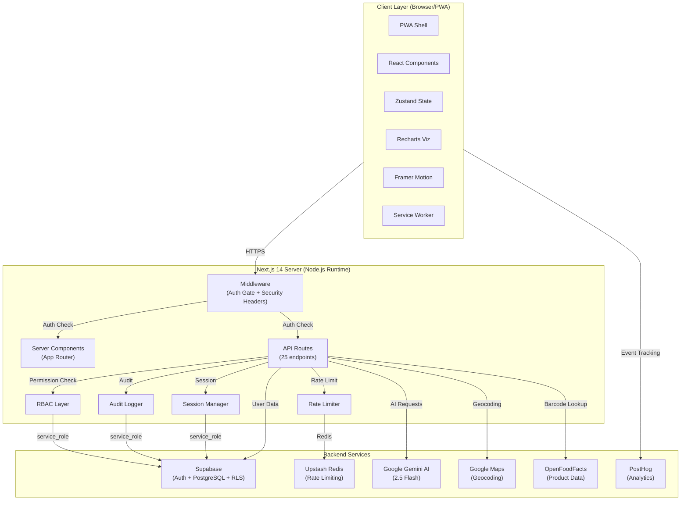
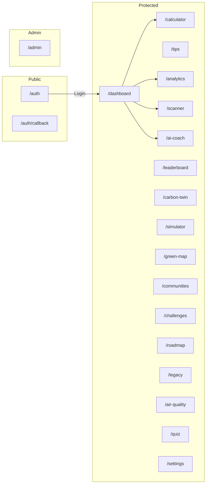
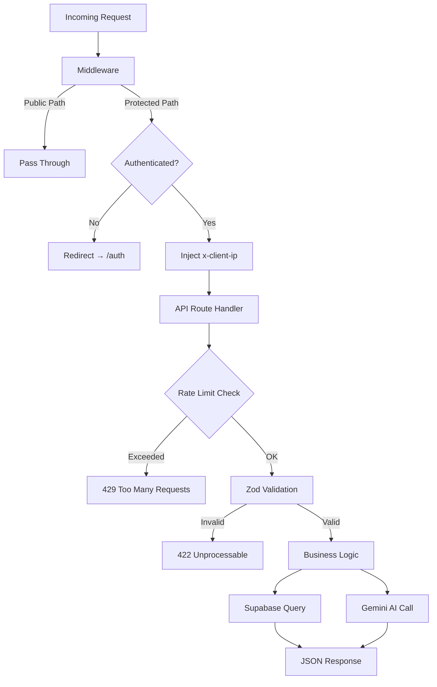
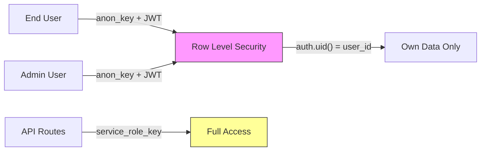
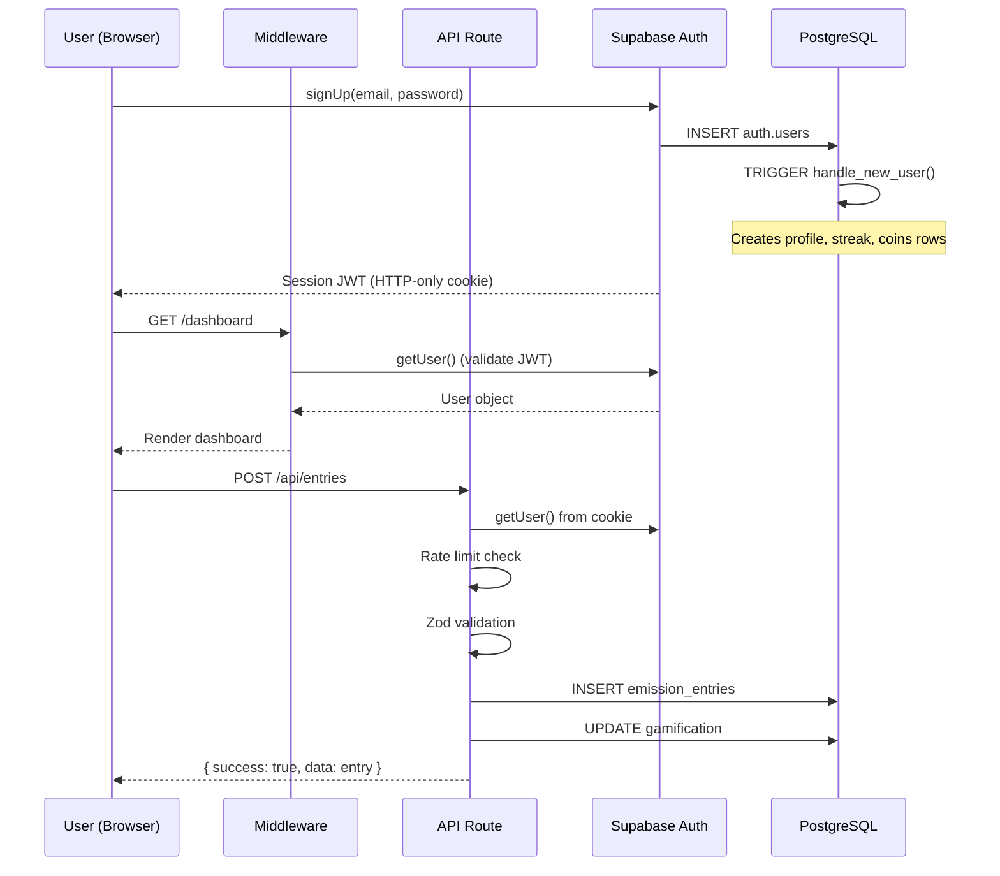
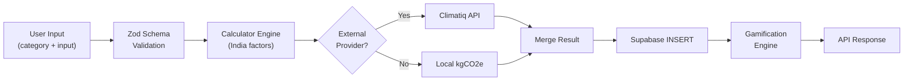
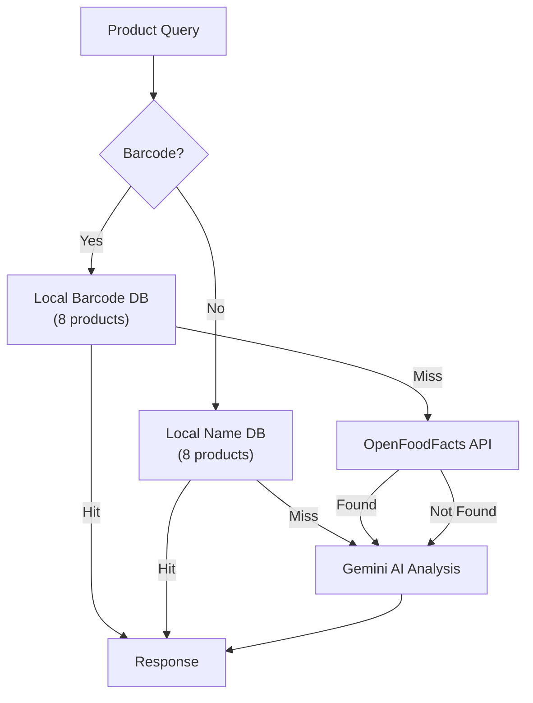
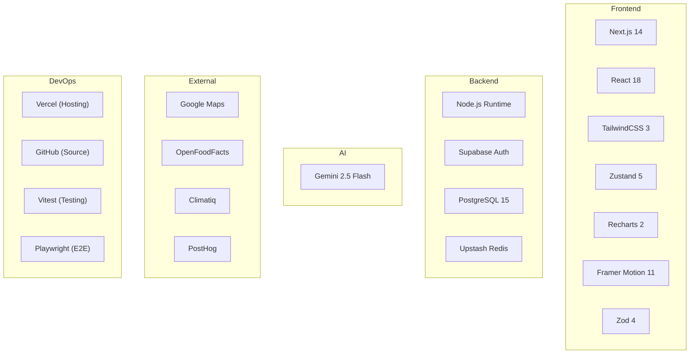

# System Architecture

> **Product:** GreenStep India  
> **Version:** 0.1.0  
> **Last Updated:** 2026-06-25  
> **Owner:** GreenStep Team  
> **Classification:** Internal / Technical

---

## Change Log

| Date       | Version | Author         | Description                         |
|------------|---------|----------------|-------------------------------------|
| 2026-06-25 | 0.1.0   | GreenStep Team | Initial architecture document       |

---

## 1. System Architecture Diagram



---

## 2. Frontend Architecture

### 2.1 Technology Stack

| Layer | Technology | Version | Purpose |
|-------|-----------|---------|---------|
| Framework | Next.js | 14.2.16 | SSR, App Router, API Routes |
| UI Library | React | 18.3.1 | Component rendering |
| State Management | Zustand | 5.0.14 | Global client state |
| Styling | TailwindCSS | 3.4.17 | Utility-first CSS |
| Components | Radix UI | Latest | Accessible primitives (Tabs, Collapsible) |
| Animation | Framer Motion | 11.18.2 | Page transitions, micro-animations |
| Charts | Recharts | 2.15.4 | Data visualization (12+ chart types) |
| Icons | Lucide React | 0.468.0 | Icon system |
| Validation | Zod | 4.4.3 | Schema validation |
| PWA | next-pwa | 5.6.0 | Service worker, offline caching |

### 2.2 Application Pages



### 2.3 Component Architecture

```
components/
├── app-shell.tsx              # Navigation wrapper (sidebar + mobile drawer)
├── ui/                        # Design system primitives
│   ├── tabs.tsx               # Radix Tabs
│   ├── collapsible.tsx        # Radix Collapsible
│   └── ...
├── analytics/                 # Enterprise analytics (10 components)
│   ├── DailyTrendChart.tsx    # Recharts ComposedChart
│   ├── WeeklyBarChart.tsx     # Color-coded bar chart
│   ├── ForecastAreaChart.tsx  # Area chart with confidence bands
│   ├── GoalProgressRing.tsx   # Animated SVG ring
│   ├── SustainabilityGauge.tsx# Half-circle SVG gauge
│   ├── CategoryRadar.tsx      # Radar chart
│   ├── HotspotHeatmap.tsx     # CSS-based grid heatmap
│   ├── InsightCard.tsx        # Stat card with sparkline
│   ├── DateRangePicker.tsx    # Preset date range selector
│   └── ExportButton.tsx       # CSV/PDF export
└── [feature]/                 # Feature-specific components
```

### 2.4 State Management Strategy

| Store | Library | Scope | Persistence |
|-------|---------|-------|-------------|
| UI State (theme, sidebar) | Zustand | Client | localStorage |
| Settings (language, units) | Zustand + Context | Client | localStorage |
| Map State | Zustand | Client | Memory |
| Auth State | Supabase SSR | Server + Client | HTTP-only cookies |
| Feature Data | React hooks (SWR pattern) | Component | Memory |

---

## 3. Backend Architecture

### 3.1 API Layer

The backend is a **serverless API** built with Next.js API Routes running on Node.js runtime.



### 3.2 API Response Envelope

All API responses follow a consistent envelope:

```typescript
// Success
{ success: true, data: T, error: null }

// Failure
{ success: false, data: null, error: "message" }

// Paginated
{ success: true, data: T[], error: null, pagination: { page, limit, total, totalPages } }
```

### 3.3 Middleware Pipeline

| Order | Layer | Responsibility |
|-------|-------|---------------|
| 1 | Path Check | Skip auth for `/auth`, `/auth/callback`, `/auth/forgot` |
| 2 | Supabase SSR | Create server client, refresh tokens via cookies |
| 3 | Auth Gate | Redirect unauthenticated users to `/auth` |
| 4 | Admin Gate | Block unauthenticated admin path access |
| 5 | IP Injection | Set `x-client-ip` header from proxy headers |
| 6 | Logged-in Redirect | Redirect authenticated users away from `/auth` |

---

## 4. Database Architecture

### 4.1 Database Provider

- **PostgreSQL 15+** via Supabase (managed, hosted)
- **Row Level Security (RLS)** on every user-facing table
- **pgcrypto** extension for UUID generation

### 4.2 Schema Groups

| Group | Tables | Purpose |
|-------|--------|---------|
| **Core** | `profiles`, `emission_entries` | User data + carbon tracking |
| **Gamification** | `user_badges`, `user_streaks`, `eco_coins`, `challenges`, `user_challenges`, `completed_tips` | Engagement |
| **Carbon Twin** | `carbon_twin`, `emission_snapshots`, `ai_roadmaps`, `roadmap_completions` | Advanced analytics |
| **Security** | `user_roles`, `user_devices`, `user_sessions`, `audit_logs`, `activity_logs` | Enterprise security |

### 4.3 Data Isolation Model



---

## 5. Authentication Flow



### Demo Mode Flow

When Supabase is not configured, the app operates in **demo mode**:
- `requireCurrentUser()` returns a demo user object
- All reads come from `lib/demo-data.ts` (30 days of synthetic data)
- All writes succeed but are not persisted
- Full feature set remains available for evaluation

---

## 6. Data Flow Diagrams

### 6.1 Emission Entry Flow



### 6.2 Product Scanner Flow



---

## 7. Technology Stack Summary



---

## 8. Scalability Strategy

### 8.1 Current Architecture (0 – 10,000 users)

| Layer | Strategy | Limit |
|-------|----------|-------|
| **Compute** | Vercel Serverless Functions | Auto-scaling, cold start ~200ms |
| **Database** | Supabase Free/Pro (PostgreSQL) | 500MB – 8GB storage |
| **Cache** | Upstash Redis (serverless) | 10,000 req/day (free) – unlimited (paid) |
| **CDN** | Vercel Edge Network | Global, 100+ PoPs |
| **AI** | Gemini 2.5 Flash | 15 RPM free, 1000 RPM paid |

### 8.2 Growth Architecture (10,000 – 100,000 users)

| Upgrade | When | Impact |
|---------|------|--------|
| Supabase Pro | > 500MB DB | Higher connection pooling, daily backups |
| Upstash Pro | > 10K req/day | Dedicated Redis, higher throughput |
| Vercel Pro | > 100GB bandwidth | Faster builds, more serverless concurrency |
| Connection Pooling | > 50 concurrent queries | PgBouncer via Supabase |
| Read Replicas | > 1000 RPM reads | Supabase read replicas for leaderboards |

### 8.3 Horizontal Scaling Considerations

- **Stateless API:** All state stored in PostgreSQL/Redis, enabling horizontal scaling
- **Edge Caching:** Static assets cached for 1 year (`immutable`)
- **PWA Offline:** Service worker caches core pages and emission factors
- **Rate Limiting:** Redis-backed rate limiting prevents abuse at scale
- **Demo Mode:** Zero-dependency mode reduces load for trial users

---

## 9. Performance Considerations

### 9.1 Frontend Optimizations

| Optimization | Implementation |
|---|---|
| **Code Splitting** | Next.js App Router automatic splitting |
| **Tree Shaking** | `optimizePackageImports` for lucide-react, recharts, framer-motion |
| **Lazy Loading** | `next/dynamic` with `{ ssr: false }` for chart components |
| **Image Optimization** | AVIF/WebP auto-format, India-optimized `deviceSizes: [360, 414, 768, 1024, 1280]` |
| **Font Loading** | Plus Jakarta Sans + DM Sans via `next/font` with `display: swap` |
| **SWC Minification** | Enabled via `swcMinify: true` |
| **Console Stripping** | `removeConsole` in production builds |

### 9.2 Backend Optimizations

| Optimization | Implementation |
|---|---|
| **Rate Limiting** | Atomic Redis Lua scripts (token bucket + sliding window) |
| **Connection Pooling** | Supabase built-in PgBouncer |
| **Parallel Queries** | `Promise.all()` for dashboard (4 concurrent queries) |
| **Pagination** | Server-side with Supabase `.range()` |
| **Fail-Open** | Rate limiter fails open on Redis errors |
| **In-Memory Fallback** | Rate limiter works without Redis in development |

### 9.3 Caching Strategy

| Resource | Strategy | TTL |
|----------|----------|-----|
| Google Fonts | CacheFirst | 365 days |
| Emission Factors JSON | CacheFirst | 30 days |
| Core Pages | StaleWhileRevalidate | 7 days |
| Navigation | NetworkFirst (4s timeout) | 24 hours |
| Static Assets | Immutable | 1 year |

---

*This document is a living specification and will be updated as the architecture evolves.*
