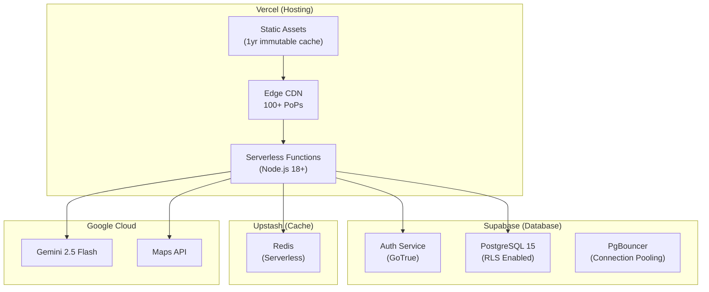
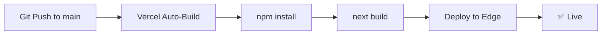
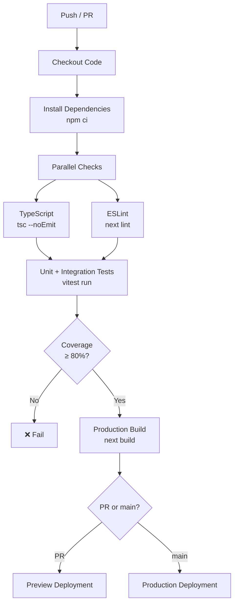

# Deployment Guide

> **Product:** GreenStep India  
> **Version:** 0.1.0  
> **Last Updated:** 2026-06-25  
> **Owner:** GreenStep Team  
> **Primary Platform:** Vercel

---

## Change Log

| Date       | Version | Author         | Description                         |
|------------|---------|----------------|-------------------------------------|
| 2026-06-25 | 0.1.0   | GreenStep Team | Initial deployment documentation    |

---

## 1. Environment Setup

### 1.1 Prerequisites

| Tool | Version | Purpose |
|------|---------|---------|
| Node.js | ≥ 18.17 | Runtime |
| npm | ≥ 9.0 | Package manager |
| Git | Latest | Version control |
| Vercel CLI | Latest (optional) | Local deployment testing |

### 1.2 Local Development Setup

```bash
# 1. Clone the repository
git clone <repo-url> greenstep-india
cd greenstep-india

# 2. Install dependencies
npm install

# 3. Create environment file
cp .env.example .env.local

# 4. Configure environment variables (see Section 1.3)
# Edit .env.local with your values

# 5. Start development server
npm run dev
# → Open http://localhost:3000
```

### 1.3 Environment Variables

#### Required for Full Functionality

| Variable | Type | Description |
|----------|------|-------------|
| `NEXT_PUBLIC_SUPABASE_URL` | Public | Supabase project URL |
| `NEXT_PUBLIC_SUPABASE_ANON_KEY` | Public | Supabase anonymous key |
| `SUPABASE_SERVICE_ROLE_KEY` | Secret | Supabase service role key (admin ops) |

#### AI & External Services

| Variable | Type | Description |
|----------|------|-------------|
| `GEMINI_API_KEY` | Secret | Google Gemini AI API key |
| `NEXT_PUBLIC_GOOGLE_MAPS_API_KEY` | Public | Google Maps JavaScript API |
| `GOOGLE_MAPS_API_KEY` | Secret | Server-side Maps API key |

#### Rate Limiting

| Variable | Type | Default | Description |
|----------|------|---------|-------------|
| `UPSTASH_REDIS_REST_URL` | Secret | — | Upstash Redis URL |
| `UPSTASH_REDIS_REST_TOKEN` | Secret | — | Upstash Redis token |
| `RATE_LIMIT_ANON_MAX` | Secret | 20 | Anonymous rate limit |
| `RATE_LIMIT_AUTH_MAX` | Secret | 100 | Authenticated rate limit |
| `RATE_LIMIT_AI_MAX` | Secret | 10 | AI endpoint rate limit |
| `RATE_LIMIT_SENSITIVE_MAX` | Secret | 5 | Sensitive endpoint rate limit |

#### Analytics (Optional)

| Variable | Type | Description |
|----------|------|-------------|
| `NEXT_PUBLIC_POSTHOG_KEY` | Public | PostHog project API key |
| `NEXT_PUBLIC_POSTHOG_HOST` | Public | PostHog host URL |
| `NEXT_PUBLIC_APP_URL` | Public | Production URL for SEO |

> **Note:** The app runs fully in **demo mode** with no environment variables configured. This allows development, testing, and evaluation without any external service dependencies.

---

## 2. Infrastructure Requirements

### 2.1 Architecture Overview



### 2.2 Service Requirements

| Service | Tier | Cost | Purpose |
|---------|------|------|---------|
| **Vercel** | Hobby/Pro | Free – $20/mo | Hosting, CDN, Serverless |
| **Supabase** | Free/Pro | Free – $25/mo | Auth, Database, RLS |
| **Upstash** | Free/Pay-as-you-go | Free – $10/mo | Rate limiting cache |
| **Gemini AI** | Free/Pay-as-you-go | Free tier – usage-based | AI Coach, Scanner |
| **Google Maps** | Pay-as-you-go | $200 free credit/mo | Green Map geocoding |
| **PostHog** | Free/Cloud | Free – usage-based | Product analytics |

### 2.3 Minimum Specifications

| Resource | Minimum | Recommended |
|----------|---------|-------------|
| **Serverless RAM** | 256 MB (Vercel default) | 512 MB |
| **Database Storage** | 500 MB (Free) | 8 GB (Pro) |
| **Database Connections** | 60 (Free) | 200 (Pro) |
| **Redis Storage** | 256 MB | 1 GB |
| **Bandwidth** | 100 GB/mo (Free) | 1 TB/mo (Pro) |

---

## 3. Database Setup

### 3.1 Supabase Project Setup

1. Create a project at [supabase.com](https://supabase.com)
2. Go to **Project Settings → API** and copy:
   - Project URL → `NEXT_PUBLIC_SUPABASE_URL`
   - `anon` key → `NEXT_PUBLIC_SUPABASE_ANON_KEY`
   - `service_role` key → `SUPABASE_SERVICE_ROLE_KEY`

### 3.2 Schema Migration

Run the following SQL files in order in the **Supabase SQL Editor**:

```bash
# Step 1: Base schema (profiles, entries, gamification)
supabase/schema.sql

# Step 2: Carbon Twin tables (twin, snapshots, roadmaps)
supabase/migrations/001_carbon_twin_tables.sql

# Step 3: Security tables (roles, devices, sessions, audit)
supabase/migrations/002_security_tables.sql
```

### 3.3 First Admin Setup

After the first user signs up, promote them to `super_admin`:

```sql
INSERT INTO user_roles (user_id, role)
VALUES ('<your-user-uuid>', 'super_admin')
ON CONFLICT (user_id) DO UPDATE SET role = 'super_admin';
```

---

## 4. Production Deployment

### 4.1 Vercel Deployment (Recommended)



#### Steps

1. **Connect Repository:**
   - Go to [vercel.com](https://vercel.com)
   - Import your GitHub repository
   - Vercel auto-detects Next.js

2. **Configure Environment Variables:**
   - Go to **Settings → Environment Variables**
   - Add all variables from `.env.example`
   - Mark secrets as "Sensitive" (encrypted at rest)

3. **Deploy:**
   - Push to `main` branch — Vercel auto-deploys
   - Preview deployments on pull requests

4. **Custom Domain (Optional):**
   - Go to **Settings → Domains**
   - Add your domain and configure DNS

### 4.2 Build Configuration

| Setting | Value |
|---------|-------|
| **Framework** | Next.js |
| **Build Command** | `next build` |
| **Output Directory** | `.next` |
| **Node.js Version** | 18.x |
| **Root Directory** | `./` |

### 4.3 Build Validation

Before deploying, run the full validation pipeline:

```bash
npm run validate
# Runs: typecheck → lint → test → build
```

---

## 5. CI/CD Pipeline

### 5.1 Pipeline Architecture



### 5.2 GitHub Actions Example

```yaml
name: CI/CD
on:
  push:
    branches: [main]
  pull_request:
    branches: [main]

jobs:
  validate:
    runs-on: ubuntu-latest
    steps:
      - uses: actions/checkout@v4
      - uses: actions/setup-node@v4
        with:
          node-version: 18
          cache: npm
      - run: npm ci
      - run: npx tsc --noEmit
      - run: npx next lint
      - run: npm test
      - run: npm run build
    env:
      NEXT_PUBLIC_SUPABASE_URL: ${{ secrets.SUPABASE_URL }}
      NEXT_PUBLIC_SUPABASE_ANON_KEY: ${{ secrets.SUPABASE_ANON_KEY }}
```

---

## 6. Rollback Strategy

### 6.1 Vercel Rollback

Vercel maintains a history of all deployments. To rollback:

1. Go to **Vercel Dashboard → Deployments**
2. Find the last known good deployment
3. Click **"..."** → **"Promote to Production"**

Rollback is **instant** — no rebuild required.

### 6.2 Database Rollback

Database migrations are applied manually via SQL Editor. To rollback:

1. Migrations are additive (CREATE TABLE IF NOT EXISTS)
2. To remove a migration: `DROP TABLE IF EXISTS <table> CASCADE;`
3. Always backup before schema changes: **Supabase Dashboard → Database → Backups**

### 6.3 Environment Variable Rollback

1. Vercel stores env var history
2. Go to **Settings → Environment Variables → Edit → View History**

---

## 7. Monitoring & Logging

### 7.1 Application Monitoring

| Layer | Tool | Metrics |
|-------|------|---------|
| **Frontend** | PostHog | Page views, feature usage, funnels |
| **Backend** | Vercel Analytics | Function duration, error rate, cold starts |
| **Database** | Supabase Dashboard | Query count, active connections, storage |
| **Cache** | Upstash Console | Redis commands, memory, latency |

### 7.2 Error Monitoring

| Source | Where | Alert |
|--------|-------|-------|
| Client errors | PostHog (auto-captured) | Dashboard alert |
| API errors | Vercel Function Logs | Slack/email webhook |
| Auth failures | `audit_logs` table | Query for `AUTH_LOGIN_FAILED` |
| Critical events | `audit_logs` table | Query for `severity = 'critical'` |

### 7.3 Health Check

The application health can be verified by:

```bash
# 1. Frontend loads
curl -s -o /dev/null -w "%{http_code}" https://promptwar-orpin.vercel.app

# 2. API responds
curl -s https://promptwar-orpin.vercel.app/api/challenges | jq .success

# 3. Auth service works
curl -s https://promptwar-orpin.vercel.app/api/auth/role | jq .role
```

### 7.4 Performance Monitoring

| Metric | Tool | Target |
|--------|------|--------|
| FCP | Vercel Web Analytics | < 1.5s |
| TTFB | Vercel Speed Insights | < 200ms |
| API p95 Latency | Vercel Function Metrics | < 500ms |
| DB Connection Time | Supabase Dashboard | < 50ms |

---

## 8. Scaling Playbook

### 8.1 When to Scale

| Signal | Action |
|--------|--------|
| DB connections > 80% | Upgrade Supabase plan |
| Redis commands > 80% limit | Upgrade Upstash plan |
| Function duration > 10s | Optimize queries, add caching |
| Bandwidth > 80% | Upgrade Vercel plan |
| Error rate > 1% | Investigate and fix |

### 8.2 Scaling Actions

| Scale Point | Current | Next Step |
|-------------|---------|-----------|
| **Database** | Free (500MB) | Pro ($25/mo, 8GB, backups) |
| **Compute** | Hobby (10s timeout) | Pro (60s timeout, more concurrency) |
| **Redis** | Free (10K/day) | Pay-as-go (unlimited) |
| **AI** | Free (15 RPM) | Paid (1000 RPM) |

---

*This document is a living specification and will be updated as infrastructure evolves.*
