# Entity Relationship Diagram (ERD)

> **Product:** GreenStep India  
> **Version:** 0.1.0  
> **Last Updated:** 2026-06-25  
> **Owner:** GreenStep Team  
> **Database:** PostgreSQL 15+ (Supabase)

---

## Change Log

| Date       | Version | Author         | Description                         |
|------------|---------|----------------|-------------------------------------|
| 2026-06-25 | 0.1.0   | GreenStep Team | Initial ERD documentation           |

---

## 1. Complete Entity Relationship Diagram

```mermaid
erDiagram
    AUTH_USERS ||--o| PROFILES : "extends"
    AUTH_USERS ||--o| CARBON_TWIN : "has"
    AUTH_USERS ||--o| USER_STREAKS : "has"
    AUTH_USERS ||--o| ECO_COINS : "has"
    AUTH_USERS ||--o| USER_ROLES : "has"
    AUTH_USERS ||--o| AI_ROADMAPS : "has"
    AUTH_USERS ||--o{ EMISSION_ENTRIES : "logs"
    AUTH_USERS ||--o{ EMISSION_SNAPSHOTS : "generates"
    AUTH_USERS ||--o{ USER_BADGES : "earns"
    AUTH_USERS ||--o{ USER_CHALLENGES : "joins"
    AUTH_USERS ||--o{ COMPLETED_TIPS : "completes"
    AUTH_USERS ||--o{ USER_DEVICES : "registers"
    AUTH_USERS ||--o{ USER_SESSIONS : "creates"
    AUTH_USERS ||--o{ AUDIT_LOGS : "triggers"
    AUTH_USERS ||--o{ ACTIVITY_LOGS : "generates"
    AUTH_USERS ||--o{ ROADMAP_COMPLETIONS : "completes"
    CHALLENGES ||--o{ USER_CHALLENGES : "has"
    USER_DEVICES ||--o{ USER_SESSIONS : "associated"
    USER_SESSIONS ||--o{ AUDIT_LOGS : "linked"
    USER_SESSIONS ||--o{ ACTIVITY_LOGS : "linked"
    USER_DEVICES ||--o{ AUDIT_LOGS : "linked"

    AUTH_USERS {
        uuid id PK
        text email
        jsonb raw_user_meta_data
        timestamptz created_at
        timestamptz last_sign_in_at
    }

    PROFILES {
        uuid id PK,FK
        text display_name
        text city
        text state
        text diet_type
        timestamptz created_at
    }

    EMISSION_ENTRIES {
        uuid id PK
        uuid user_id FK
        date entry_date
        text category
        text sub_type
        numeric quantity
        text unit
        numeric kg_co2e
        text notes
        timestamptz created_at
    }

    CARBON_TWIN {
        uuid id PK
        uuid user_id FK,UK
        jsonb diet
        jsonb travel
        jsonb energy
        jsonb shopping
        jsonb waste
        timestamptz created_at
        timestamptz updated_at
    }

    EMISSION_SNAPSHOTS {
        uuid id PK
        uuid user_id FK
        char7 year_month
        numeric total_kg
        numeric diet_kg
        numeric travel_kg
        numeric energy_kg
        numeric shopping_kg
        numeric waste_kg
        smallint health_score
        timestamptz created_at
    }

    AI_ROADMAPS {
        uuid id PK
        uuid user_id FK,UK
        jsonb roadmap_json
        timestamptz generated_at
        smallint total_weeks
        numeric projected_saving_kg
    }

    ROADMAP_COMPLETIONS {
        uuid id PK
        uuid user_id FK
        smallint week_number
        timestamptz completed_at
    }

    USER_BADGES {
        uuid id PK
        uuid user_id FK
        text badge_slug
        timestamptz earned_at
    }

    USER_STREAKS {
        uuid user_id PK,FK
        int current_streak
        int longest_streak
        date last_entry_date
    }

    ECO_COINS {
        uuid user_id PK,FK
        int total_coins
    }

    CHALLENGES {
        uuid id PK
        text title
        text description
        numeric target_kg
        int duration_days
        date starts_at
        date ends_at
    }

    USER_CHALLENGES {
        uuid user_id PK,FK
        uuid challenge_id PK,FK
        timestamptz joined_at
        numeric progress_kg
        boolean completed
    }

    COMPLETED_TIPS {
        uuid user_id PK,FK
        text tip_id PK
        timestamptz completed_at
    }

    USER_ROLES {
        uuid id PK
        uuid user_id FK,UK
        text role
        uuid assigned_by FK
        timestamptz assigned_at
        boolean is_banned
        timestamptz banned_at
        text banned_reason
    }

    USER_DEVICES {
        uuid id PK
        uuid user_id FK
        text fingerprint
        text device_type
        text os
        text browser
        text language
        text timezone
        text screen_resolution
        text ip_address
        text user_agent
        timestamptz first_seen_at
        timestamptz last_seen_at
        boolean is_trusted
        text trust_label
        boolean is_blocked
    }

    USER_SESSIONS {
        uuid id PK
        uuid user_id FK
        uuid device_id FK
        text ip_address
        text status
        timestamptz created_at
        timestamptz last_active_at
        timestamptz expires_at
        timestamptz revoked_at
        uuid revoked_by FK
        text revoked_reason
    }

    AUDIT_LOGS {
        uuid id PK
        uuid actor_id FK
        text actor_email
        text actor_role
        text target_id
        text target_type
        text action
        text severity
        text description
        jsonb metadata
        text ip_address
        uuid device_id FK
        uuid session_id FK
        timestamptz created_at
    }

    ACTIVITY_LOGS {
        uuid id PK
        uuid user_id FK
        uuid session_id FK
        text event
        text page
        jsonb metadata
        int duration_ms
        timestamptz created_at
    }
```

---

## 2. Database Tables

### 2.1 Core Tables

#### `profiles`

Extends Supabase `auth.users`. Created automatically via `handle_new_user()` trigger.

| Column | Type | Constraints | Default | Description |
|--------|------|------------|---------|-------------|
| `id` | `uuid` | PK, FK → auth.users(id) ON DELETE CASCADE | — | User ID |
| `display_name` | `text` | — | — | Display name |
| `city` | `text` | — | `'Haridwar'` | User's city |
| `state` | `text` | — | `'Uttarakhand'` | User's state |
| `diet_type` | `text` | CHECK (vegetarian, non_veg, vegan) | `'vegetarian'` | Diet preference |
| `created_at` | `timestamptz` | — | `now()` | Registration time |

#### `emission_entries`

Daily carbon footprint log entries.

| Column | Type | Constraints | Default | Description |
|--------|------|------------|---------|-------------|
| `id` | `uuid` | PK | `gen_random_uuid()` | Entry ID |
| `user_id` | `uuid` | FK → profiles(id) ON DELETE CASCADE | — | Owner |
| `entry_date` | `date` | NOT NULL | `current_date` | Date of activity |
| `category` | `text` | NOT NULL, CHECK (transport, energy, diet, shopping, waste, digital) | — | Emission category |
| `sub_type` | `text` | — | — | Subcategory (e.g., "petrol_car") |
| `quantity` | `numeric` | NOT NULL | — | Amount logged |
| `unit` | `text` | NOT NULL | — | Unit of measurement |
| `kg_co2e` | `numeric` | NOT NULL | — | Calculated CO₂ equivalent |
| `notes` | `text` | — | — | User notes |
| `created_at` | `timestamptz` | — | `now()` | Created timestamp |

### 2.2 Carbon Twin Tables

#### `carbon_twin`

Digital twin lifestyle profile — one row per user, upserted on profile update.

| Column | Type | Constraints | Default | Description |
|--------|------|------------|---------|-------------|
| `id` | `uuid` | PK | `gen_random_uuid()` | Row ID |
| `user_id` | `uuid` | FK → auth.users, UNIQUE, NOT NULL | — | Owner |
| `diet` | `jsonb` | NOT NULL | `'{}'` | Diet profile (DietProfile) |
| `travel` | `jsonb` | NOT NULL | `'{}'` | Travel profile (TravelProfile) |
| `energy` | `jsonb` | NOT NULL | `'{}'` | Energy profile (EnergyProfile) |
| `shopping` | `jsonb` | NOT NULL | `'{}'` | Shopping profile (ShoppingProfile) |
| `waste` | `jsonb` | NOT NULL | `'{}'` | Waste profile (WasteProfile) |
| `created_at` | `timestamptz` | — | `now()` | Created timestamp |
| `updated_at` | `timestamptz` | — | `now()` | Last update |

#### `emission_snapshots`

Monthly aggregated emission snapshots for trend analysis and forecasting.

| Column | Type | Constraints | Default | Description |
|--------|------|------------|---------|-------------|
| `id` | `uuid` | PK | `gen_random_uuid()` | Snapshot ID |
| `user_id` | `uuid` | FK → auth.users, NOT NULL | — | Owner |
| `year_month` | `char(7)` | NOT NULL, UNIQUE(user_id, year_month) | — | Period (e.g., "2026-06") |
| `total_kg` | `numeric(8,2)` | NOT NULL | — | Total emissions |
| `diet_kg` | `numeric(8,2)` | — | `0` | Diet breakdown |
| `travel_kg` | `numeric(8,2)` | — | `0` | Travel breakdown |
| `energy_kg` | `numeric(8,2)` | — | `0` | Energy breakdown |
| `shopping_kg` | `numeric(8,2)` | — | `0` | Shopping breakdown |
| `waste_kg` | `numeric(8,2)` | — | `0` | Waste breakdown |
| `health_score` | `smallint` | — | — | Carbon health score (0-100) |
| `created_at` | `timestamptz` | — | `now()` | Created timestamp |

### 2.3 Gamification Tables

#### `user_badges`

| Column | Type | Constraints | Default |
|--------|------|------------|---------|
| `id` | `uuid` | PK | `gen_random_uuid()` |
| `user_id` | `uuid` | FK → profiles(id), UNIQUE(user_id, badge_slug) | — |
| `badge_slug` | `text` | NOT NULL | — |
| `earned_at` | `timestamptz` | — | `now()` |

#### `user_streaks`

| Column | Type | Constraints | Default |
|--------|------|------------|---------|
| `user_id` | `uuid` | PK, FK → profiles(id) | — |
| `current_streak` | `int` | — | `0` |
| `longest_streak` | `int` | — | `0` |
| `last_entry_date` | `date` | — | — |

#### `eco_coins`

| Column | Type | Constraints | Default |
|--------|------|------------|---------|
| `user_id` | `uuid` | PK, FK → profiles(id) | — |
| `total_coins` | `int` | — | `0` |

#### `challenges`

| Column | Type | Constraints | Default |
|--------|------|------------|---------|
| `id` | `uuid` | PK | `gen_random_uuid()` |
| `title` | `text` | — | — |
| `description` | `text` | — | — |
| `target_kg` | `numeric` | — | — |
| `duration_days` | `int` | — | — |
| `starts_at` | `date` | — | — |
| `ends_at` | `date` | — | — |

#### `user_challenges`

| Column | Type | Constraints | Default |
|--------|------|------------|---------|
| `user_id` | `uuid` | PK, FK → profiles(id) | — |
| `challenge_id` | `uuid` | PK, FK → challenges(id) | — |
| `joined_at` | `timestamptz` | — | `now()` |
| `progress_kg` | `numeric` | — | `0` |
| `completed` | `boolean` | — | `false` |

### 2.4 Security Tables

#### `user_roles`

| Column | Type | Constraints | Default |
|--------|------|------------|---------|
| `id` | `uuid` | PK | `gen_random_uuid()` |
| `user_id` | `uuid` | FK → auth.users, UNIQUE, NOT NULL | — |
| `role` | `text` | CHECK (super_admin, admin, moderator, premium_user, user, guest) | `'user'` |
| `assigned_by` | `uuid` | FK → auth.users ON DELETE SET NULL | — |
| `assigned_at` | `timestamptz` | — | `now()` |
| `is_banned` | `boolean` | — | `false` |
| `banned_at` | `timestamptz` | — | — |
| `banned_reason` | `text` | — | — |

#### `user_devices`

| Column | Type | Constraints | Default |
|--------|------|------------|---------|
| `id` | `uuid` | PK | `gen_random_uuid()` |
| `user_id` | `uuid` | FK → auth.users, UNIQUE(user_id, fingerprint) | — |
| `fingerprint` | `text` | NOT NULL | — |
| `device_type` | `text` | — | `'unknown'` |
| `os` | `text` | — | `'unknown'` |
| `browser` | `text` | — | `'unknown'` |
| `ip_address` | `text` | — | — |
| `is_trusted` | `boolean` | — | `false` |
| `is_blocked` | `boolean` | — | `false` |

#### `audit_logs`

| Column | Type | Constraints | Default |
|--------|------|------------|---------|
| `id` | `uuid` | PK | `gen_random_uuid()` |
| `actor_id` | `uuid` | FK → auth.users ON DELETE SET NULL | — |
| `action` | `text` | NOT NULL | — |
| `severity` | `text` | CHECK (info, warning, critical) | `'info'` |
| `description` | `text` | NOT NULL | — |
| `metadata` | `jsonb` | — | `'{}'` |
| `created_at` | `timestamptz` | — | `now()` |

---

## 3. Primary Keys

| Table | Primary Key | Type |
|-------|-------------|------|
| `profiles` | `id` | UUID (FK from auth.users) |
| `emission_entries` | `id` | UUID (auto-generated) |
| `carbon_twin` | `id` | UUID (auto-generated) |
| `emission_snapshots` | `id` | UUID (auto-generated) |
| `ai_roadmaps` | `id` | UUID (auto-generated) |
| `roadmap_completions` | `id` | UUID (auto-generated) |
| `user_badges` | `id` | UUID (auto-generated) |
| `user_streaks` | `user_id` | UUID (FK) |
| `eco_coins` | `user_id` | UUID (FK) |
| `challenges` | `id` | UUID (auto-generated) |
| `user_challenges` | `(user_id, challenge_id)` | Composite |
| `completed_tips` | `(user_id, tip_id)` | Composite |
| `user_roles` | `id` | UUID (auto-generated) |
| `user_devices` | `id` | UUID (auto-generated) |
| `user_sessions` | `id` | UUID (auto-generated) |
| `audit_logs` | `id` | UUID (auto-generated) |
| `activity_logs` | `id` | UUID (auto-generated) |

---

## 4. Foreign Keys

| From Table | Column | → To Table | Column | On Delete |
|------------|--------|-----------|--------|-----------|
| `profiles` | `id` | `auth.users` | `id` | CASCADE |
| `emission_entries` | `user_id` | `profiles` | `id` | CASCADE |
| `user_badges` | `user_id` | `profiles` | `id` | CASCADE |
| `user_streaks` | `user_id` | `profiles` | `id` | CASCADE |
| `eco_coins` | `user_id` | `profiles` | `id` | CASCADE |
| `user_challenges` | `user_id` | `profiles` | `id` | CASCADE |
| `user_challenges` | `challenge_id` | `challenges` | `id` | CASCADE |
| `completed_tips` | `user_id` | `profiles` | `id` | CASCADE |
| `carbon_twin` | `user_id` | `auth.users` | `id` | CASCADE |
| `emission_snapshots` | `user_id` | `auth.users` | `id` | CASCADE |
| `ai_roadmaps` | `user_id` | `auth.users` | `id` | CASCADE |
| `roadmap_completions` | `user_id` | `auth.users` | `id` | CASCADE |
| `user_roles` | `user_id` | `auth.users` | `id` | CASCADE |
| `user_roles` | `assigned_by` | `auth.users` | `id` | SET NULL |
| `user_devices` | `user_id` | `auth.users` | `id` | CASCADE |
| `user_sessions` | `user_id` | `auth.users` | `id` | CASCADE |
| `user_sessions` | `device_id` | `user_devices` | `id` | SET NULL |
| `user_sessions` | `revoked_by` | `auth.users` | `id` | SET NULL |
| `audit_logs` | `actor_id` | `auth.users` | `id` | SET NULL |
| `audit_logs` | `device_id` | `user_devices` | `id` | SET NULL |
| `audit_logs` | `session_id` | `user_sessions` | `id` | SET NULL |
| `activity_logs` | `user_id` | `auth.users` | `id` | CASCADE |
| `activity_logs` | `session_id` | `user_sessions` | `id` | SET NULL |

---

## 5. Indexing Strategy

### Core Indexes

| Table | Index | Columns | Purpose |
|-------|-------|---------|---------|
| `carbon_twin` | `idx_carbon_twin_user` | `user_id` | Fast profile lookup |
| `emission_snapshots` | `idx_snapshots_user` | `user_id` | User snapshot lookup |
| `emission_snapshots` | `idx_snapshots_user_month` | `user_id, year_month DESC` | Time-series queries |
| `ai_roadmaps` | `idx_roadmaps_user` | `user_id` | Roadmap lookup |

### Security Indexes

| Table | Index | Columns | Purpose |
|-------|-------|---------|---------|
| `user_roles` | `idx_user_roles_user` | `user_id` | RBAC lookups |
| `user_devices` | `idx_devices_user` | `user_id` | Device listing |
| `user_devices` | `idx_devices_fingerprint` | `fingerprint` | Dedup detection |
| `user_sessions` | `idx_sessions_user` | `user_id` | Session listing |
| `user_sessions` | `idx_sessions_status` | `status` | Active session queries |
| `audit_logs` | `idx_audit_actor` | `actor_id` | User audit trail |
| `audit_logs` | `idx_audit_action` | `action` | Action filtering |
| `audit_logs` | `idx_audit_severity` | `severity` | Alert queries |
| `audit_logs` | `idx_audit_created` | `created_at DESC` | Reverse-chronological |
| `activity_logs` | `idx_activity_user` | `user_id` | User activity |
| `activity_logs` | `idx_activity_event` | `event` | Event filtering |
| `activity_logs` | `idx_activity_created` | `created_at DESC` | Reverse-chronological |

---

## 6. Unique Constraints

| Table | Columns | Purpose |
|-------|---------|---------|
| `carbon_twin` | `user_id` | One twin per user |
| `ai_roadmaps` | `user_id` | One active roadmap per user |
| `emission_snapshots` | `(user_id, year_month)` | One snapshot per user per month |
| `roadmap_completions` | `(user_id, week_number)` | One completion per week |
| `user_badges` | `(user_id, badge_slug)` | No duplicate badges |
| `completed_tips` | `(user_id, tip_id)` | Idempotent tip completion |
| `user_roles` | `user_id` | One role per user |
| `user_devices` | `(user_id, fingerprint)` | No duplicate devices |

---

## 7. Data Integrity Rules

### CHECK Constraints

| Table | Column | Allowed Values |
|-------|--------|---------------|
| `profiles` | `diet_type` | `vegetarian`, `non_veg`, `vegan` |
| `emission_entries` | `category` | `transport`, `energy`, `diet`, `shopping`, `waste`, `digital` |
| `user_roles` | `role` | `super_admin`, `admin`, `moderator`, `premium_user`, `user`, `guest` |
| `user_sessions` | `status` | `active`, `expired`, `revoked` |
| `audit_logs` | `severity` | `info`, `warning`, `critical` |

### Trigger Functions

| Trigger | On | Function | Description |
|---------|-----|----------|-------------|
| `on_auth_user_created` | `INSERT` on `auth.users` | `handle_new_user()` | Auto-creates `profiles`, `user_streaks`, and `eco_coins` rows |

### Business Rules

1. **Cascade Deletion:** Deleting a user removes all associated data across all tables.
2. **Audit Preservation:** Audit logs use `SET NULL` on actor deletion — logs survive user deletion.
3. **Idempotent Operations:** `ON CONFLICT DO NOTHING` prevents duplicate badge/tip/streak inserts.
4. **Session Expiry:** Default session lifetime is 30 days (`NOW() + INTERVAL '30 days'`).
5. **JSONB Profiles:** Carbon Twin uses JSONB columns to avoid schema migration for profile extensions.

---

## 8. Migration History

| Migration | File | Tables Created |
|-----------|------|---------------|
| Base Schema | `supabase/schema.sql` | `profiles`, `emission_entries`, `user_badges`, `user_streaks`, `eco_coins`, `challenges`, `user_challenges`, `completed_tips` |
| 001 | `001_carbon_twin_tables.sql` | `carbon_twin`, `emission_snapshots`, `ai_roadmaps`, `roadmap_completions` |
| 002 | `002_security_tables.sql` | `user_roles`, `user_devices`, `user_sessions`, `audit_logs`, `activity_logs` |

---

*This document is a living specification and will be updated as the schema evolves.*
