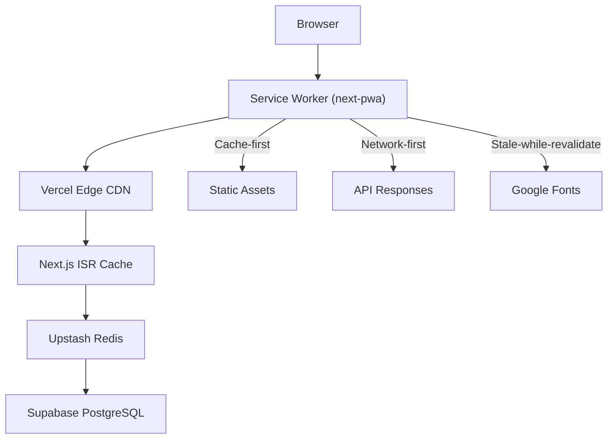

# Performance Optimization Guide

> **Document Version:** 0.1.0  
> **Last Updated:** 2025-06-24  
> **Target:** Lighthouse 90+ across all categories  
> **Owner:** Engineering Team

---

## 1. Performance Architecture

### Design Principles

GreenStep India follows a **performance-first architecture**:

1. **Server-first rendering** — Next.js 14 App Router with React Server Components (RSC)
2. **Progressive enhancement** — Core functionality works without JavaScript
3. **Edge-optimized** — Vercel Edge CDN for static assets
4. **Lazy everything** — Dynamic imports, image lazy loading, intersection observers

### Performance Budget

| Metric | Budget | Current Target |
|--------|--------|---------------|
| **First Contentful Paint (FCP)** | < 1.5s | < 1.2s |
| **Largest Contentful Paint (LCP)** | < 2.5s | < 2.0s |
| **First Input Delay (FID)** | < 100ms | < 50ms |
| **Cumulative Layout Shift (CLS)** | < 0.1 | < 0.05 |
| **Time to Interactive (TTI)** | < 3.5s | < 3.0s |
| **Total Blocking Time (TBT)** | < 300ms | < 200ms |
| **JS Bundle (initial)** | < 200 KB | < 150 KB |

---

## 2. Rendering Strategy

### React Server Components (RSC)

Most pages use Server Components by default — only interactive components use `"use client"`:

```
Server Components (default)    Client Components ("use client")
──────────────────────────     ────────────────────────────────
app/layout.tsx                 components/app-shell.tsx
app/page.tsx                   components/EarthGlobe.tsx
app/dashboard/page.tsx         components/analytics/*.tsx
app/calculator/page.tsx        components/calculator/*.tsx
                               app/providers.tsx
```

### Data Fetching Patterns

| Pattern | Usage | Example |
|---------|-------|---------|
| Server fetch | Dashboard stats | `fetch()` in Server Component |
| Client fetch | Chart data | `useEffect` + `fetch` |
| Static generation | SEO pages | `generateStaticParams()` |
| Incremental Static Regen | Leaderboard | `revalidate: 60` |

---

## 3. Bundle Optimization

### Code Splitting Strategy

```typescript
// ✅ Dynamic imports for heavy components
const EarthGlobe = dynamic(() => import("@/components/EarthGlobe"), {
  ssr: false,
  loading: () => <Skeleton className="h-64 rounded-2xl" />,
});

const IndiaMap3D = dynamic(() => import("@/components/IndiaMap3D"), {
  ssr: false,
  loading: () => <Skeleton className="h-48 rounded-2xl" />,
});

// ✅ Route-level code splitting (automatic with App Router)
// Each app/ directory page is a separate chunk
```

### Tree Shaking

```typescript
// ✅ Named imports for tree shaking
import { LineChart, BarChart } from "recharts";
import { RefreshCw, Leaf } from "lucide-react";

// ❌ Avoid default imports of entire libraries
// import * as Recharts from "recharts";
```

### Bundle Analysis

Key library sizes (gzipped):

| Library | Size | Optimization |
|---------|------|-------------|
| `react` + `react-dom` | ~42 KB | Shared chunk |
| `recharts` | ~55 KB | Dynamic import per chart page |
| `framer-motion` | ~32 KB | Tree-shaken, minimal features |
| `@supabase/supabase-js` | ~25 KB | Conditional load (demo mode skips) |
| `zod` | ~12 KB | Shared validation chunk |
| `zustand` | ~2 KB | Minimal footprint |
| `lucide-react` | ~3 KB | Per-icon tree shaking |

---

## 4. Caching Strategy

### Multi-Layer Cache Architecture



### Service Worker Caching (next-pwa)

```javascript
// next.config.js - PWA caching rules
runtimeCaching: [
  {
    urlPattern: /^https:\/\/fonts\.googleapis\.com/,
    handler: "StaleWhileRevalidate",
    options: { cacheName: "google-fonts-stylesheets" },
  },
  {
    urlPattern: /^https:\/\/fonts\.gstatic\.com/,
    handler: "CacheFirst",
    options: {
      cacheName: "google-fonts-webfonts",
      expiration: { maxEntries: 30, maxAgeSeconds: 365 * 24 * 60 * 60 },
    },
  },
]
```

### API Response Caching

| Endpoint | Strategy | TTL | Notes |
|----------|----------|-----|-------|
| `/api/tips` | Cache-Control | 1 hour | Static content |
| `/api/challenges` | Cache-Control | 30 min | Infrequent changes |
| `/api/leaderboard` | ISR | 60s | Revalidate on demand |
| `/api/dashboard` | No cache | — | User-specific data |
| `/api/entries` | No cache | — | User-specific data |

---

## 5. Image Optimization

### Strategy

```tsx
// ✅ Next.js Image component with automatic optimization
import Image from "next/image";

<Image
  src="/icons/icon-512.png"
  alt="GreenStep logo"
  width={512}
  height={512}
  priority          // LCP image: preload
  quality={85}      // Balanced quality
/>

// ✅ Lazy loading for below-fold images
<Image
  src="/eco-spot.jpg"
  alt="Eco-friendly spot"
  width={400}
  height={300}
  loading="lazy"    // Default behavior
/>
```

### Icon System

- **Lucide React** icons — SVG-based, tree-shakeable, ~300 bytes per icon
- **PWA icons** — Pre-generated at 192px and 512px in PNG format
- No raster icon sprites — all vector-based

---

## 6. Font Optimization

```typescript
// app/layout.tsx — Google Fonts with next/font
const dmSans = DM_Sans({
  subsets: ["latin"],
  variable: "--font-body",
  display: "swap",           // No FOIT (Flash of Invisible Text)
  weight: ["400", "500", "600", "700", "800"],
});

const plusJakarta = Plus_Jakarta_Sans({
  subsets: ["latin"],
  variable: "--font-heading",
  display: "swap",
  weight: ["600", "700", "800"],
});
```

**Optimizations applied:**
- `next/font` auto-hosts fonts (no external requests)
- `display: "swap"` prevents invisible text during load
- Only required weights loaded (not full family)
- Font files cached by service worker (365-day TTL)

---

## 7. JavaScript Performance

### React Optimization Patterns

```typescript
// ✅ Memoization for expensive calculations
const memoizedStats = useMemo(() => computeStats(entries), [entries]);

// ✅ useCallback for event handlers passed to children
const handleSubmit = useCallback((data: FormData) => {
  // ...
}, [dependency]);

// ✅ Debounced inputs for search/filter
import debounce from "lodash.debounce";
const debouncedSearch = useMemo(
  () => debounce(handleSearch, 300),
  [handleSearch]
);
```

### Preventing Unnecessary Re-renders

- Zustand store with **selectors** — components only re-render when their slice changes
- `React.memo()` on expensive list item components
- Stable object references via `useMemo` for context values

---

## 8. API Performance

### Rate Limiting (prevents abuse, protects performance)

| Tier | Limit | Window | Use Case |
|------|-------|--------|----------|
| Anonymous | 20 req | 60s | Public pages |
| Authenticated | 100 req | 60s | Logged-in users |
| AI endpoints | 10 req | 60s | Gemini API calls |
| Sensitive | 5 req | 60s | Admin actions |

### API Response Optimization

```typescript
// ✅ Consistent response envelope (minimal overhead)
{
  success: true,
  data: { /* payload */ },
  error: null,
  requestId: "req_abc123"  // For tracing
}

// ✅ Pagination for large datasets
{
  success: true,
  data: [...],
  pagination: { page: 1, limit: 20, total: 150, totalPages: 8 }
}
```

---

## 9. Lighthouse Targets

| Category | Target | Strategy |
|----------|--------|----------|
| **Performance** | 90+ | RSC, code splitting, image optimization, font swap |
| **Accessibility** | 95+ | WCAG 2.1 AA compliance (see Accessibility.md) |
| **Best Practices** | 95+ | HTTPS, CSP headers, no deprecated APIs |
| **SEO** | 95+ | Sitemap, robots.txt, meta tags, semantic HTML |
| **PWA** | ✅ | Manifest, service worker, offline support |

### Monitoring

| Tool | Purpose | Frequency |
|------|---------|-----------|
| Lighthouse CI | Automated scoring | Every PR |
| Vercel Analytics | Real User Monitoring | Continuous |
| PostHog | User engagement metrics | Continuous |
| Web Vitals | Core metrics tracking | Continuous |

---

## 10. Performance Checklist

### Build-time
- [x] Tree shaking enabled (Next.js default)
- [x] Code splitting by route (App Router automatic)
- [x] Dynamic imports for heavy components
- [x] Font subsetting with `next/font`
- [x] Image optimization with `next/image`
- [x] CSS purging via Tailwind CSS

### Runtime
- [x] Service worker for offline caching
- [x] Debounced search/filter inputs
- [x] Memoized expensive calculations
- [x] Zustand selectors prevent unnecessary re-renders
- [x] API rate limiting prevents abuse
- [x] Skeleton loading states (no layout shift)

### Deployment
- [x] Vercel Edge CDN for global distribution
- [x] Brotli/gzip compression (Vercel default)
- [x] HTTP/2 with multiplexing
- [x] Security headers (CSP, HSTS) don't block critical resources
- [x] ISR for semi-static content
