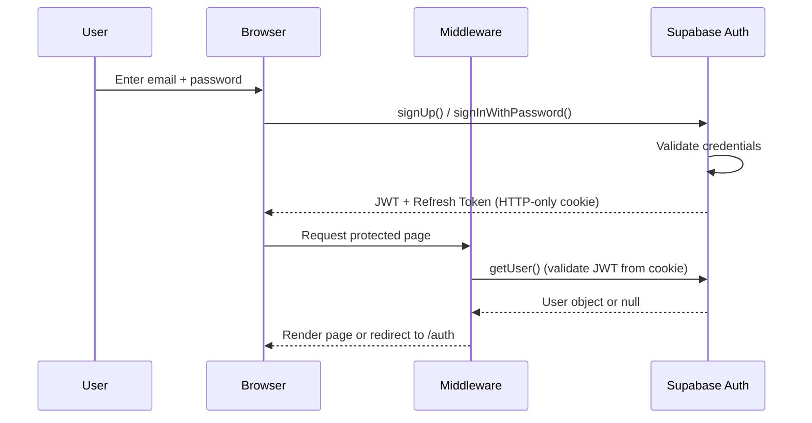
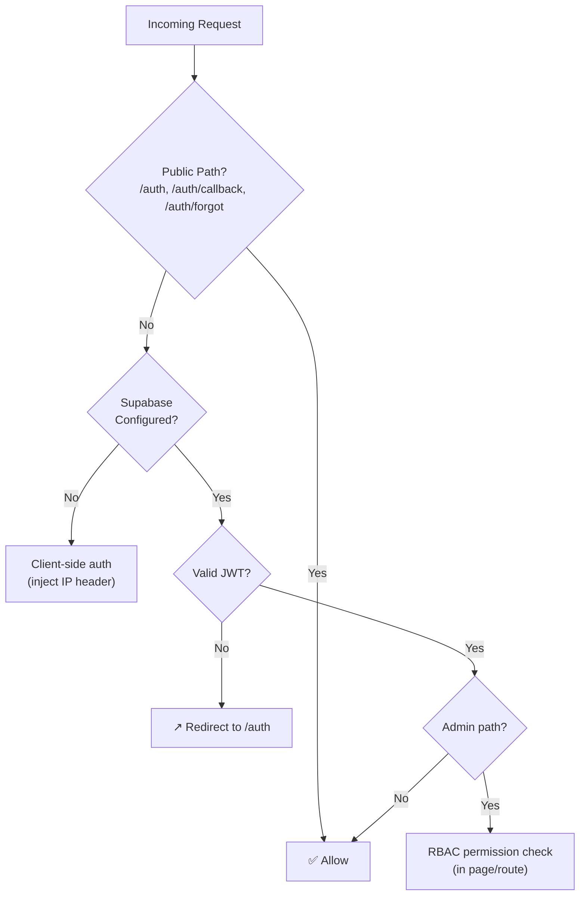
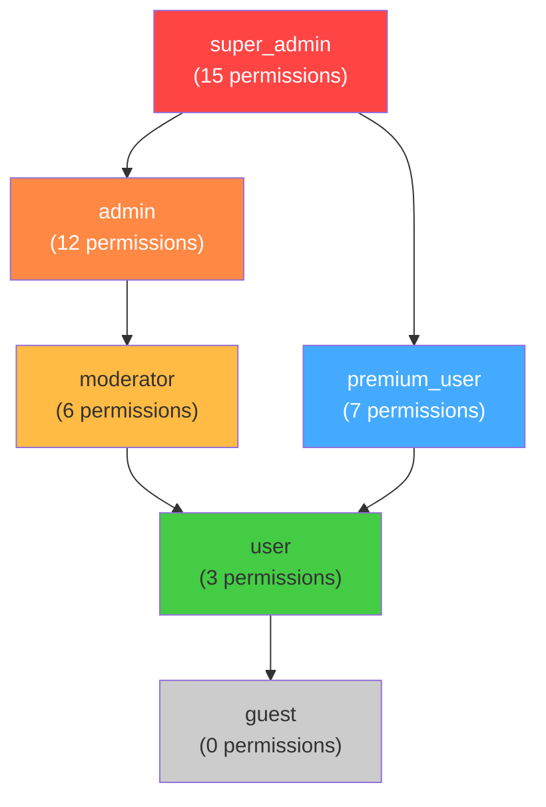
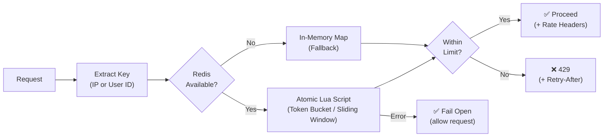

# Security Documentation

> **Product:** GreenStep India  
> **Version:** 0.1.0  
> **Last Updated:** 2026-06-25  
> **Owner:** GreenStep Team  
> **Classification:** Confidential — Internal Use Only

---

## Change Log

| Date       | Version | Author         | Description                         |
|------------|---------|----------------|-------------------------------------|
| 2026-06-25 | 0.1.0   | GreenStep Team | Initial security documentation      |

---

## 1. Authentication

### 1.1 Authentication Provider

GreenStep uses **Supabase Auth** (GoTrue) as its identity provider:

| Property | Value |
|----------|-------|
| **Provider** | Supabase Auth (GoTrue) |
| **Methods** | Email + Password, Magic Link |
| **Token Format** | JWT (JSON Web Token) |
| **Token Storage** | HTTP-only cookies (via `@supabase/ssr`) |
| **Token Refresh** | Automatic via middleware |
| **Session Duration** | 30 days (configurable) |

### 1.2 Authentication Flow



### 1.3 Demo Mode

When Supabase environment variables are not configured, the app enters **demo mode**:
- A synthetic user is returned by `requireCurrentUser()`
- All features remain functional with `demo-data.ts`
- No real authentication or data persistence occurs
- Useful for evaluations, demos, and development

---

## 2. Authorization

### 2.1 Route Protection



### 2.2 Three-Tier Authorization

| Tier | Mechanism | Scope |
|------|-----------|-------|
| **1. Middleware** | JWT validation | All non-public routes |
| **2. API Route** | `requireCurrentUser()` + `verifyApiPermission()` | Individual endpoints |
| **3. Database** | Row Level Security (RLS) | All table access |

---

## 3. Role-Based Access Control (RBAC)

### 3.1 Role Hierarchy



### 3.2 Permission Matrix

| Permission | super_admin | admin | moderator | premium_user | user | guest |
|------------|:-----------:|:-----:|:---------:|:------------:|:----:|:-----:|
| `admin:view_dashboard` | ✅ | ✅ | ✅ | ❌ | ❌ | ❌ |
| `admin:manage_users` | ✅ | ✅ | ❌ | ❌ | ❌ | ❌ |
| `admin:assign_roles` | ✅ | ❌ | ❌ | ❌ | ❌ | ❌ |
| `admin:view_audit_logs` | ✅ | ✅ | ❌ | ❌ | ❌ | ❌ |
| `admin:view_all_sessions` | ✅ | ✅ | ❌ | ❌ | ❌ | ❌ |
| `admin:force_logout` | ✅ | ✅ | ❌ | ❌ | ❌ | ❌ |
| `admin:view_activity_logs` | ✅ | ✅ | ✅ | ❌ | ❌ | ❌ |
| `admin:export_data` | ✅ | ❌ | ❌ | ❌ | ❌ | ❌ |
| `user:read_own_data` | ✅ | ✅ | ✅ | ✅ | ✅ | ❌ |
| `user:write_own_data` | ✅ | ✅ | ✅ | ✅ | ✅ | ❌ |
| `user:delete_own_data` | ✅ | ❌ | ❌ | ✅ | ✅ | ❌ |
| `premium:ai_roadmap` | ✅ | ✅ | ✅ | ✅ | ❌ | ❌ |
| `premium:ai_explainer` | ✅ | ✅ | ❌ | ✅ | ❌ | ❌ |
| `premium:carbon_forecast` | ✅ | ✅ | ✅ | ✅ | ❌ | ❌ |
| `premium:advanced_export` | ✅ | ✅ | ❌ | ✅ | ❌ | ❌ |

### 3.3 RBAC Implementation

| Component | File | Purpose |
|-----------|------|---------|
| Permission Matrix | `lib/types/security.ts` | Single source of truth for role→permissions mapping |
| Permission Check | `lib/rbac/check-permission.ts` | `checkPermission(userId, permission)` |
| Role Lookup | `lib/rbac/get-user-role.ts` | `getUserRole(userId)` via service_role key |
| Server Guard | `lib/rbac/with-role.ts` | `requirePermission()` for Server Components |
| API Guard | `lib/rbac/with-role.ts` | `verifyApiPermission()` for API routes |

### 3.4 Unauthorized Access Handling

When a user attempts an action without proper permissions:
1. Access attempt is **audit-logged** with severity `warning`
2. User is **redirected** to `/dashboard` (Server Components)
3. API returns **403 Forbidden** (API Routes)
4. Metadata includes the required permission and actual user role

---

## 4. Session Security

### 4.1 Session Architecture

| Property | Value |
|----------|-------|
| **Storage** | `user_sessions` table (PostgreSQL) |
| **Lifetime** | 30 days (configurable) |
| **Status Values** | `active`, `expired`, `revoked` |
| **Device Linking** | Each session linked to a `user_devices` record |
| **IP Tracking** | Client IP stored per session |

### 4.2 Session Operations

| Operation | Method | Access |
|-----------|--------|--------|
| Create Session | `createSession()` | On login (service_role) |
| Touch Session | `touchSession()` | On each request (service_role) |
| Revoke Session | `revokeSession()` | By user or admin (service_role) |
| Revoke All | `revokeAllUserSessions()` | Admin force-logout (service_role) |
| List Active | `getActiveSessions()` | User or admin (service_role) |

### 4.3 Device Fingerprinting

Each device is fingerprinted using:
- Device type (mobile/tablet/desktop)
- Operating system
- Browser
- Language
- Timezone
- Screen resolution

Fingerprints are hashed and stored in `user_devices`. New device detections trigger a `DEVICE_NEW_DEVICE_DETECTED` audit event.

---

## 5. Data Encryption

### 5.1 Data In Transit

| Layer | Protection |
|-------|-----------|
| **Client ↔ Server** | TLS 1.3 (enforced by Vercel + HSTS) |
| **Server ↔ Supabase** | TLS 1.3 (Supabase managed) |
| **Server ↔ Redis** | TLS 1.3 (Upstash REST API over HTTPS) |
| **Server ↔ Gemini** | TLS 1.3 (Google API) |

### 5.2 Data At Rest

| Data | Protection |
|------|-----------|
| **Database** | AES-256 (Supabase managed encryption) |
| **Auth Tokens** | HTTP-only, Secure, SameSite cookies |
| **API Keys** | Server-side environment variables only |
| **Audit Logs** | Metadata sanitized (FORBIDDEN_KEYS filter) |

### 5.3 Sensitive Data Handling

The audit logger sanitizes metadata before storage:

```typescript
const FORBIDDEN_KEYS = ['password', 'token', 'secret', 'key', 'auth', 'cookie', 'session_token'];
```

Any metadata key containing these substrings is stripped before insertion.

---

## 6. API Security

### 6.1 Security Headers

Configured in `next.config.js` for all routes:

| Header | Value | Purpose |
|--------|-------|---------|
| `X-Frame-Options` | `DENY` | Prevent clickjacking |
| `X-Content-Type-Options` | `nosniff` | Prevent MIME sniffing |
| `Referrer-Policy` | `strict-origin-when-cross-origin` | Control referrer leaks |
| `Permissions-Policy` | `camera=(), microphone=(), geolocation=(self)` | Restrict APIs |
| `Strict-Transport-Security` | `max-age=31536000; includeSubDomains` | Force HTTPS |
| `Content-Security-Policy` | See below | XSS prevention |

### 6.2 Content Security Policy

```
default-src 'self';
script-src 'self' 'unsafe-inline' 'unsafe-eval' https://app.posthog.com https://maps.googleapis.com;
style-src 'self' 'unsafe-inline' https://fonts.googleapis.com;
font-src 'self' https://fonts.gstatic.com;
img-src 'self' data: blob: https: http:;
connect-src 'self' https://*.supabase.co https://generativelanguage.googleapis.com
            https://app.posthog.com https://maps.googleapis.com https://world.openfoodfacts.org;
frame-ancestors 'none';
```

### 6.3 Rate Limiting Architecture



### 6.4 Input Validation

All API inputs are validated with **Zod schemas** before processing:

| Schema | Validates |
|--------|----------|
| `entryBodySchema` | Emission entry creation |
| `aiCoachSchema` | AI conversation messages |
| `scannerSchema` | Product scanner queries |
| `carbonIntelligenceSchema` | Full lifestyle analysis |
| `geocodeSchema` | Address geocoding |
| `tipCompleteSchema` | Tip completion |
| `challengeJoinSchema` | Challenge joining |
| `paginationSchema` | Page/limit parameters |

Invalid input returns `422 Unprocessable Entity` with human-readable error details.

---

## 7. OWASP Top 10 Considerations

| # | Vulnerability | Mitigation | Status |
|---|---|---|---|
| **A01** | Broken Access Control | RLS on all tables, RBAC with 6 roles, middleware auth gate | ✅ |
| **A02** | Cryptographic Failures | TLS 1.3 everywhere, AES-256 at rest, no plaintext secrets | ✅ |
| **A03** | Injection | Parameterized Supabase queries, Zod input validation | ✅ |
| **A04** | Insecure Design | Defense-in-depth (middleware → RBAC → RLS), audit logging | ✅ |
| **A05** | Security Misconfiguration | `poweredByHeader: false`, CSP, HSTS, Permissions-Policy | ✅ |
| **A06** | Vulnerable Components | Automated `npm audit`, no known CVEs in deps | ✅ |
| **A07** | Auth Failures | Rate-limited login (5/15min), session expiry, device tracking | ✅ |
| **A08** | Data Integrity | Zod validation, CHECK constraints, UNIQUE constraints | ✅ |
| **A09** | Logging & Monitoring | 18 audit actions, 3 severity levels, PostHog analytics | ✅ |
| **A10** | SSRF | Allowlisted external APIs in CSP `connect-src` | ✅ |

---

## 8. Vulnerability Prevention

### 8.1 XSS Prevention
- React's automatic JSX escaping
- Content Security Policy with allowlisted sources
- No `dangerouslySetInnerHTML` without sanitization

### 8.2 CSRF Prevention
- `SameSite` cookie attribute (set by Supabase SSR)
- Origin verification in middleware

### 8.3 SQL Injection Prevention
- Supabase client uses parameterized queries (never raw SQL in app code)
- All user input validated through Zod schemas

### 8.4 API Key Protection
- `GEMINI_API_KEY` — server-side only (not `NEXT_PUBLIC_`)
- `SUPABASE_SERVICE_ROLE_KEY` — server-side only
- Admin operations use dedicated `createAdminSupabaseClient()` (never anon key)

### 8.5 DoS Prevention
- Four-tier rate limiting (anon, auth, AI, sensitive)
- Redis-backed atomic Lua scripts for distributed limiting
- Fail-open strategy prevents Redis outages from blocking all traffic
- Pagination on all list endpoints (max 100 items)

---

## 9. Audit Logging

### 9.1 Audit Actions

| Action | Severity | Trigger |
|--------|----------|---------|
| `AUTH_LOGIN_SUCCESS` | info | Successful login |
| `AUTH_LOGIN_FAILED` | warning | Failed login attempt |
| `AUTH_LOGOUT` | info | User logout |
| `AUTH_PASSWORD_CHANGED` | info | Password change |
| `AUTH_SESSION_REVOKED` | info | Session revocation |
| `AUTH_SUSPICIOUS_LOGIN` | critical | Anomalous login pattern |
| `RBAC_ROLE_ASSIGNED` | info | Role change |
| `RBAC_ROLE_REMOVED` | info | Role removal |
| `RBAC_UNAUTHORIZED_ACCESS` | warning | Permission denied |
| `DATA_PROFILE_UPDATED` | info | Profile update |
| `DATA_ACCOUNT_DELETED` | critical | Account deletion |
| `DATA_EXPORT_REQUESTED` | info | Data export |
| `ADMIN_USER_VIEWED` | info | Admin views user list |
| `ADMIN_FORCE_LOGOUT` | warning | Admin force-logout |
| `ADMIN_ROLE_CHANGED` | warning | Admin changes role |
| `DEVICE_NEW_DEVICE_DETECTED` | info | New device seen |
| `DEVICE_TRUSTED` | info | Device marked trusted |
| `DEVICE_BLOCKED` | warning | Device blocked |

### 9.2 Audit Logger Design

- **Append-only** — logs are never modified or deleted
- **Never throws** — all errors are caught silently to prevent app crashes
- **Sanitized** — sensitive metadata keys are stripped before storage
- **Server-side only** — uses `service_role` key, never called from client

### 9.3 Security Monitoring

| Metric | Alert Condition |
|--------|----------------|
| Failed logins | > 5 in 15 minutes per IP |
| Critical audit events | Any `critical` severity event |
| New device detection | New fingerprint on existing account |
| Unauthorized access | Any `RBAC_UNAUTHORIZED_ACCESS` event |
| Bulk data export | Any `DATA_EXPORT_REQUESTED` event |

---

## 10. Security Checklist

- [x] All environment variables use server-side only (non-`NEXT_PUBLIC_`) for secrets
- [x] `poweredByHeader: false` in Next.js config
- [x] HSTS with 1-year `max-age` and `includeSubDomains`
- [x] CSP blocks all frame embedding (`frame-ancestors 'none'`)
- [x] Row Level Security enabled on all 17 tables
- [x] Passwords never logged or stored in plaintext
- [x] API keys proxied through server (never exposed to client)
- [x] Rate limiting on all endpoints with 4 tiers
- [x] Input validation via Zod on all POST endpoints
- [x] Audit logging for 18 security-relevant actions
- [x] Session management with create/touch/revoke lifecycle
- [x] Device fingerprinting with trust/block capabilities
- [x] RBAC with 6 roles and 15 granular permissions
- [x] Fail-open rate limiter to prevent availability impact
- [x] Metadata sanitization strips secrets from audit logs

---

*This document is a living specification and will be updated as security requirements evolve.*
