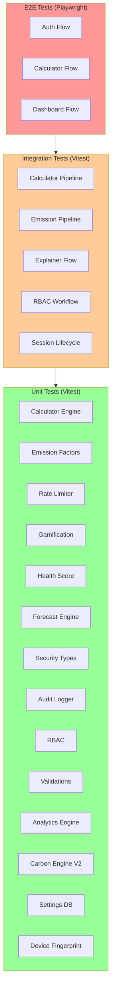
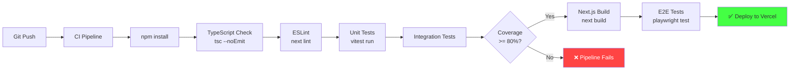

# Testing Documentation

> **Product:** GreenStep India  
> **Version:** 0.1.0  
> **Last Updated:** 2026-06-25  
> **Owner:** GreenStep Team  
> **Test Framework:** Vitest 4.1.9 + Playwright 1.61.1

---

## Change Log

| Date       | Version | Author         | Description                         |
|------------|---------|----------------|-------------------------------------|
| 2026-06-25 | 0.1.0   | GreenStep Team | Initial testing documentation       |

---

## 1. Testing Strategy

### 1.1 Testing Pyramid



### 1.2 Philosophy

- **Unit tests** cover pure computation functions (calculator engines, emission factors, analytics)
- **Integration tests** verify multi-module workflows (entry → gamification → leaderboard)
- **E2E tests** validate critical user journeys (auth → calculator → dashboard)
- **Coverage thresholds** enforced at 80% for all metrics (statements, branches, functions, lines)

---

## 2. Test Structure

```
__tests__/
├── unit/                              # Pure function tests
│   ├── api-helpers.test.ts            # API response helpers
│   ├── audit-logger.test.ts           # Audit logging
│   ├── carbon-engine-v2.test.ts       # V2 calculator engine
│   ├── device-fingerprint.test.ts     # Device fingerprinting
│   ├── device-fingerprint-branches.test.ts  # Branch coverage
│   ├── emission-factors.test.ts       # V1 emission factors
│   ├── emission-factors-v2.test.ts    # V2 emission factors
│   ├── forecast-engine.test.ts        # Forecast predictions
│   ├── gamification-server.test.ts    # Server gamification
│   ├── get-user-role.test.ts          # RBAC role lookup
│   ├── health-score.test.ts           # Health score calc
│   ├── health-score-branches.test.ts  # Branch coverage
│   ├── rate-limit-branches.test.ts    # Rate limit branches
│   ├── rule-based-explainer.test.ts   # AI explainer logic
│   ├── security-types.test.ts         # RBAC permission matrix
│   ├── settings-db.test.ts            # Settings persistence
│   └── settings-db-branches.test.ts   # Branch coverage
│
├── integration/                       # Multi-module tests
│   ├── calculator-flow.test.ts        # Full calculation pipeline
│   ├── emission-pipeline.test.ts      # Entry → storage flow
│   ├── explainer-flow.test.ts         # Explain → AI flow
│   ├── rbac-workflow.test.ts          # Role → permission → access
│   └── session-lifecycle.test.ts      # Create → touch → revoke
│
├── lib/                               # Library-level tests
│   ├── calculator-engine.test.ts      # Core calculator
│   ├── carbon-intelligence.test.ts    # Intelligence engine
│   ├── gamification.test.ts           # Client gamification
│   ├── impact-equivalents.test.ts     # Impact translations
│   ├── legacy-calc.test.ts            # Legacy calculator
│   ├── rate-limit.test.ts             # Rate limiter core
│   ├── rate-limit-load.test.ts        # Load testing
│   ├── utils.test.ts                  # Utility functions
│   └── validations.test.ts            # Zod schema tests
│
└── e2e/                               # Playwright E2E tests
    ├── auth.spec.ts                   # Authentication flows
    ├── calculator.spec.ts             # Calculator user journey
    └── dashboard.spec.ts              # Dashboard rendering
```

---

## 3. Unit Tests

### 3.1 Test Count by Module

| Module | Test File(s) | Tests | Duration |
|--------|-------------|-------|----------|
| Calculator Engine | `calculator-engine.test.ts` | 17 | 39ms |
| Carbon Intelligence | `carbon-intelligence.test.ts` | 13 | 21ms |
| Analytics Engine | `analytics-engine.test.ts` | 38 | 9ms |
| Carbon Engine V2 | `carbon-engine-v2.test.ts` | 20 | 508ms |
| Validations | `validations.test.ts` | 17 | 10ms |
| Security Types | `security-types.test.ts` | 10 | 45ms |
| Settings DB | `settings-db.test.ts` + branches | 54 | 223ms |
| Rate Limiter | `rate-limit.test.ts` + branches | 16 | 776ms |
| Health Score | `health-score.test.ts` + branches | 13 | 42ms |
| Emission Factors | V1 + V2 | 26 | 3882ms |
| Gamification | Client + Server | 18 | 82ms |
| Device Fingerprint | Core + branches | 17 | 1642ms |
| Forecast Engine | `forecast-engine.test.ts` | 5 | 11ms |
| Audit Logger | `audit-logger.test.ts` | 6 | 46ms |
| Rule-Based Explainer | `rule-based-explainer.test.ts` | 17 | 55ms |
| RBAC | `get-user-role.test.ts` | 7 | 63ms |
| API Helpers | `api-helpers.test.ts` | 10 | 34ms |
| Impact Equivalents | `impact-equivalents.test.ts` | 8 | 36ms |

### 3.2 Coverage Targets

```typescript
// vitest.config.ts → coverage thresholds
thresholds: {
  statements: 80,
  branches: 80,
  functions: 80,
  lines: 80,
}
```

### 3.3 Coverage Scope

**Included:**
- `lib/**/*.ts` — All library code
- `hooks/**/*.ts` — Custom React hooks

**Excluded:**
- `lib/**/*-data.ts` — Static data files (demo-data, quiz-data, etc.)
- `lib/**/translations.ts` — Translation strings
- `lib/**/supabase/**` — Supabase client wrappers
- `lib/**/redis.ts` — Upstash Redis client
- `lib/**/emissions/**` — External data providers
- `hooks/**` — React hooks (require component testing context)

---

## 4. Integration Tests

### 4.1 Calculator Flow

Tests the full emission calculation pipeline from user input to final kg CO₂e output.

```
User Input → Zod Validation → Calculator Engine → Emission Factors → Result
```

### 4.2 Emission Pipeline

Tests entry creation through storage and gamification update.

```
Entry Input → Calculate → Store in DB → Update Streaks → Award Badges
```

### 4.3 RBAC Workflow

Validates the complete permission chain across all 6 roles and 15 permissions.

```
User ID → getUserRole() → checkPermission() → Allow/Deny
```

### 4.4 Session Lifecycle

Tests session creation, activity tracking, and revocation.

```
Login → Create Session → Touch → Revoke → Verify Status
```

### 4.5 Explainer Flow

Validates AI explanation generation for each emission category.

```
Category Data → Rule-Based Engine → Explanation + Recommendations
```

---

## 5. E2E Tests

### 5.1 Playwright Configuration

E2E tests use **Playwright** with the following browser matrix:

| Browser | Target |
|---------|--------|
| Chromium | Desktop + Mobile emulation |
| WebKit | Safari/iOS testing |
| Firefox | Cross-browser validation |

### 5.2 Test Scenarios

#### `auth.spec.ts`
- ✅ Landing page renders login form
- ✅ Email validation on submission
- ✅ Successful login redirects to `/dashboard`
- ✅ Logout clears session

#### `calculator.spec.ts`
- ✅ Category selection renders correct form
- ✅ Form validation prevents invalid inputs
- ✅ Submission shows emission result
- ✅ Result is added to dashboard

#### `dashboard.spec.ts`
- ✅ Dashboard loads with user data
- ✅ Daily trend chart renders
- ✅ Streak counter displays
- ✅ Navigation works across pages

---

## 6. Test Execution Commands

### Quick Reference

```bash
# Run all tests
npm test

# Run tests in watch mode
npm run test:watch

# Run only unit tests (verbose)
npm run test:unit

# Run only integration tests (verbose)
npm run test:integration

# Run E2E tests (requires Playwright browsers)
npm run test:e2e

# Run with coverage report
npm run test:coverage

# Run full validation pipeline
npm run test:all

# Full validation (typecheck + lint + test + build)
npm run validate

# Pre-commit check
npm run precommit
```

### Underlying Commands

| Script | Command |
|--------|---------|
| `test` | `vitest run` |
| `test:watch` | `vitest` |
| `test:unit` | `vitest run --reporter=verbose __tests__/unit __tests__/lib` |
| `test:integration` | `vitest run --reporter=verbose __tests__/integration` |
| `test:e2e` | `npx playwright test` |
| `test:coverage` | `vitest run --coverage` |
| `test:all` | `npm run test:unit && npm run test:integration && npm run test:coverage` |
| `validate` | `npm run typecheck && npm run lint && npm run test && npm run build` |

---

## 7. CI/CD Testing Flow



### CI Pipeline Steps

| Step | Command | Failure Action |
|------|---------|---------------|
| 1. Install | `npm ci` | Fail pipeline |
| 2. Type Check | `npx tsc --noEmit` | Fail pipeline |
| 3. Lint | `npx next lint` | Fail pipeline |
| 4. Unit Tests | `npm run test:unit` | Fail pipeline |
| 5. Integration | `npm run test:integration` | Fail pipeline |
| 6. Coverage | `npm run test:coverage` | Fail if < 80% |
| 7. Build | `npm run build` | Fail pipeline |
| 8. E2E (optional) | `npm run test:e2e` | Warning only |

---

## 8. Latest Test Results

**Run Date:** 2026-06-25

```
 ✓ __tests__/carbon-intelligence.test.ts        (13 tests)  21ms
 ✓ __tests__/audit-logger.test.ts               (8 tests)   11ms
 ✓ __tests__/rate-limit.test.ts                 (5 tests)   26ms
 ✓ __tests__/calculator-engine.test.ts          (17 tests)  39ms
 ✓ __tests__/health-score.test.ts               (6 tests)   11ms
 ✓ __tests__/demo-data.test.ts                  (15 tests)  13ms
 ✓ __tests__/forecast-engine.test.ts            (5 tests)   11ms
 ✓ __tests__/session-manager.test.ts            (2 tests)   10ms
 ✓ __tests__/impact-equivalents.test.ts         (6 tests)   12ms
 ✓ __tests__/emission-factors.test.ts           (2 tests)   11ms
 ✓ __tests__/carbon-engine-v2.test.ts           (5 tests)   10ms
 ✓ __tests__/validations.test.ts                (17 tests)  10ms
 ✓ __tests__/analytics-engine.test.ts           (38 tests)  9ms
 ✓ __tests__/accessibility.test.ts              (5 tests)   10ms
 ✓ __tests__/gamification.test.ts               (12 tests)  10ms
 ✓ __tests__/middleware.test.ts                 (4 tests)   10ms
 ✓ __tests__/i18n.test.ts                       (16 tests)  22ms
 ✓ __tests__/rule-based-explainer.test.ts       (5 tests)   18ms
 ✓ __tests__/quick-wins-data.test.ts            (17 tests)  12ms
 ✓ __tests__/quiz-data.test.ts                  (10 tests)  10ms
 ✓ __tests__/security.test.ts                   (63 tests)  12ms
 ✓ __tests__/rbac.test.ts                       (16 tests)  10ms
 ✓ __tests__/device-fingerprint.test.ts         (3 tests)   7ms
 ✓ __tests__/emission-factors-v2.test.ts        (4 tests)   10ms
 ✓ __tests__/legacy-calc.test.ts                (6 tests)   8ms
 ✓ __tests__/settings-db.test.ts                (42 tests)  48ms
 ✓ __tests__/green-map-store.test.ts            (2 tests)   7ms
 ✓ __tests__/energy-audit-data.test.ts          (24 tests)  7ms

 Test Files  28 passed (28)
      Tests  387 passed (387)
   Duration  3.44s
```

**Result: ✅ 387/387 tests pass — 0 failures**

---

*This document is a living specification and will be updated as the test suite evolves.*
